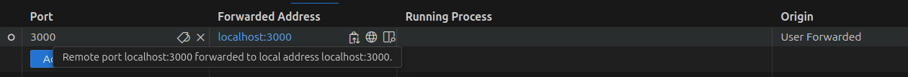
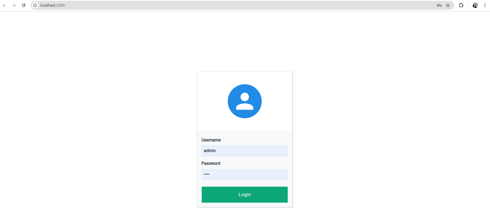
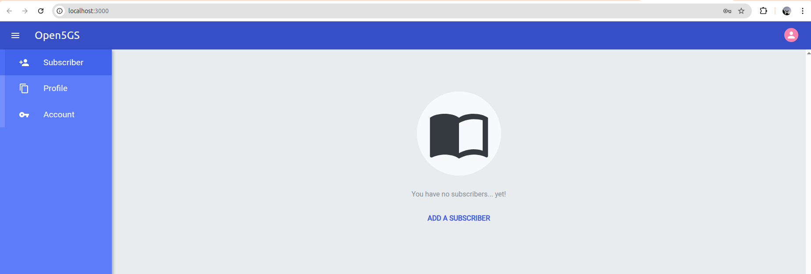
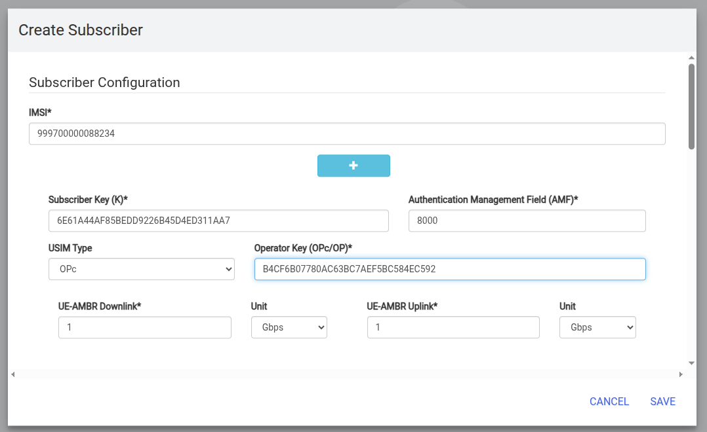
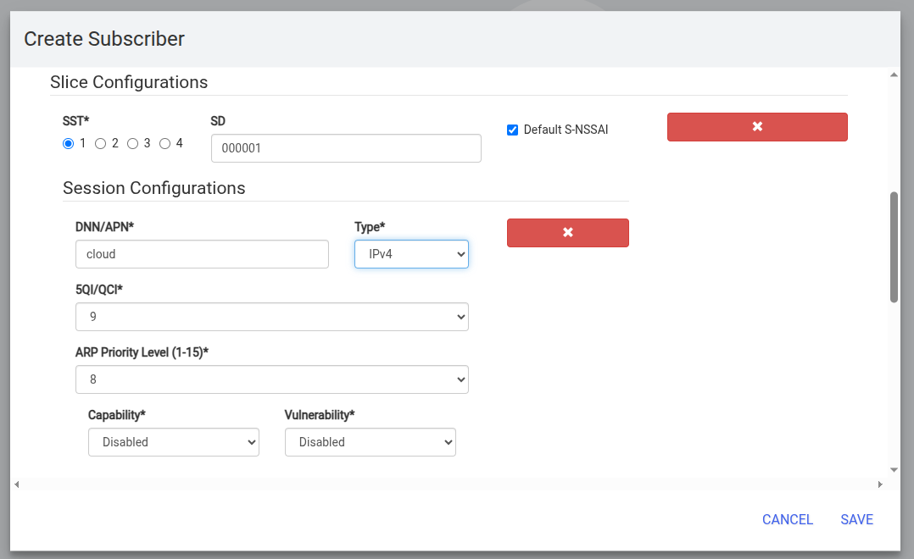
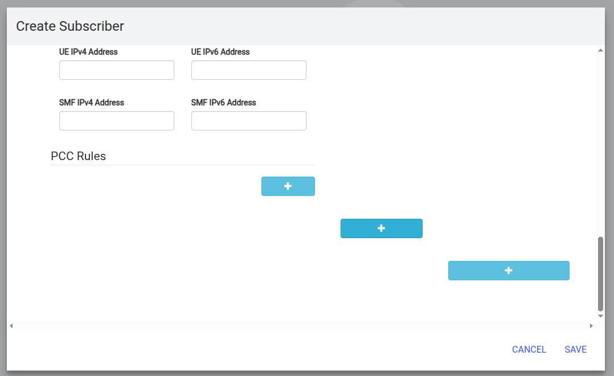
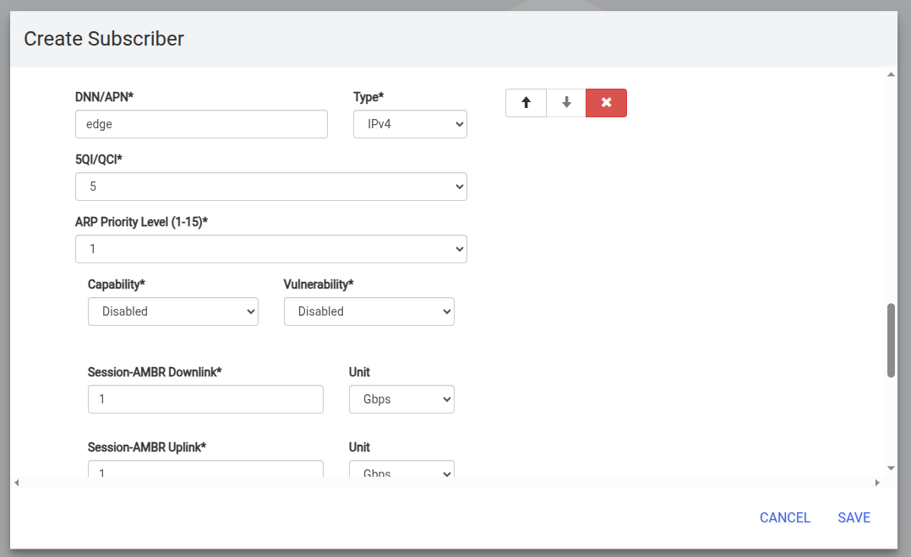

# Open5GS 2-UPF cloud-edge deployment

This repository provides a complete deployment setup for a 5G standalone core using Open5GS (version **2.6.6**) and Amarisoft gNB. It supports a dual deployment architecture with two pairs of SMF/UPF components: one in the **cloud** and one at the **edge**. The UE dynamically selects the user plane route based on the **APN** configuration: one APN points to the cloud UPF, and another points to the edge UPF, enabling differentiated traffic handling and slicing.

⚠️ The version of Open5GS is **pinned to 2.6.6** in the Dockerfile to ensure compatibility. Using a different version may result in errors due to changes in configuration formats or APIs in newer releases.

This project builds upon the original work by Herle Supreeth:  
🔗 [https://github.com/herlesupreeth/docker_open5gs](https://github.com/herlesupreeth/docker_open5gs)


## 📁 Repository structure

Each folder corresponds to a network function or support module:

- `amf/` – **Access and Mobility Management Function**: Handles UE registration, connection management, and mobility.
- `smf/` – **Session Management Function**: Manages sessions, APN selection, and interaction with UPFs.
- `upf/` – **User Plane Function**: Routes and forwards user traffic toward the internet or data network.
- `ausf/` – **Authentication Server Function**: Authenticates UEs using information from UDM and security keys.
- `pcf/` – **Policy Control Function**: Applies network policies to sessions (QoS, traffic rules).
- `udm/` – **Unified Data Management**: Stores subscriber profiles (e.g., subscription, authentication credentials).
- `udr/` – **Unified Data Repository**: Backend storage for UDM and PCF data.
- `nrf/` – **Network Repository Function**: Allows service discovery between network functions.
- `nssf/` – **Network Slice Selection Function**: Assigns slices based on UE subscription or request.
- `bsf/` – **Binding Support Function**: Manages binding of IP addresses to subscribers for IP session continuity.
- `scp/` – **Service Communication Proxy**: Manages HTTP/2 message routing between control plane functions.
- `webui/` – **Web-based User Interface**: Allows operator to manage subscribers, devices, and sessions visually.

Additional components:

- `metrics/`: Prometheus exporter for monitoring Open5GS services.
- `mqtt/`: MQTT config file for the broker.
- `scripts/`: Shell scripts for image building, service orchestration, and automation.
- `SIM/`: Contains SIM profiles and parameters used in the lab (IMSI, K, OPc, etc.) and commands to program a SIM for slicing support.
- `UERANSIM/`: Simulation tool to emulate UE and gNB behavior for local testing.
- `.env`: Docker environment configuration.
- `deployment.yaml`: Main Docker Compose file used to launch the architecture.


## ⚙️ Initial setup: cloud and edge nodes

This project can be deployed in two ways:
- ☁️ **Cloud-only** deployment (all Open5GS services run in the cloud)
- ☁️ **Cloud + 🖥️ Edge** deployment (SMF and UPF are replicated at edge and the route to internet selected via APN)

The following steps must be applied to **each node** involved in the deployment (either cloud or edge), with some configuration differences depending on the role.


### 1. Clone the repository

On each node (cloud and edge), clone this repository and navigate into it:

```bash
git clone <this_repo_url>
cd open5gs-2upf
```


### 2. Configure the `.env` file

Each node requires a local `.env` file. The following variables must be set depending on the role.

#### ☁️ 🖥️ Common to Cloud and Edge

Edit the `.env` file:

```bash
nano .env
```

Set the host IP of the current machine:

```env
DOCKER_HOST_IP=192.168.X.X
```

Also configure the UPF advertising IPs:

```env
UPF_ADVERTISE_IP=192.168.X.X      # Cloud node
UPF2_ADVERTISE_IP=192.168.Y.Y     # Edge node
```

> On the **cloud node**, only `UPF_ADVERTISE_IP` needs to be changed.  
> On the **edge node**, only `UPF2_ADVERTISE_IP` must be changed.

To ensure that the system is able to resolve domain names, ensure the DNS IP is changed in both machines:

```env
SMF_DNS1=192.168.50.1 # If your DNS if different change this
SMF_DNS2=192.168.50.1
```
> Change both in both machines (cloud and edge)

#### 🖥️ Only on the edge node

To ensure that the edge services can discover the cloud-deployed components, update the following IPs to point to the **cloud node**:

```env
SCP_IP=192.168.CLOUD_IP
NRF_IP=192.168.CLOUD_IP
```

No need to modify these on the cloud node.


### 3. Build the Open5GS Docker image

Build the Docker image for Open5GS (only required once per node):

```bash
cd scripts
./build.sh
```

This script compiles Open5GS version **2.6.6** and creates the Docker image.


### 4. Proceed to Amarisoft gNB configuration

With the environment configured and Docker images built,  
you can now configure the **Amarisoft gNB** to connect to the cloud-deployed AMF.


## 📡 Amarisoft gNB configuration

> ⚠️ **Note**: If SDRs are not detected after a reboot or crash, you must reinitialize them manually:
>
> ```bash
> cd trx_sdr/kernel/
> sudo ./init.sh
> ```

To connect Amarisoft gNB to the cloud AMF:

1. On the Amarisoft machine, go to:

```bash
cd enb/config
```

2. Copy or create a new config file from a standalone profile:

```bash
cp gnb-sa-* gnb-sa-open5gs
```

3. Edit the file `gnb-sa-open5gs` and set the IP and port of the AMF and the gNB machine IP:

```c
  amf_list: [
    {
      /* address of AMF for NGAP connection. Must be modified if the AMF runs on a different host */
      amf_addr: "192.168.x.x:38412",
    },
  ],
  /* GTP bind address (=address of the ethernet interface connected to the AMF). Must be modified if the AMF runs on a different host. */
  gtp_addr: "192.168.x.x"
```

4. Create or update the symlink `enb.cfg`:

```bash
ln -sf gnb-sa-open5gs enb.cfg
```

5. Restart the Amarisoft LTE service:

```bash
sudo systemctl restart lte.service
```

To debug Amarisoft and access the interactive menu:

```bash
screen -r
```


## 🚀 Deploying the Docker services

To launch the Open5GS services on each node, use the predefined scripts available in the `scripts/` folder.

### 🛠️ Available scripts

- `runCloud.sh` – for deploying services on the **cloud node**
- `runEdge.sh` – for deploying services on the **edge node**

To execute them do the following on the desired node:

```bash
cd scripts # In both nodes
bash runCloud.sh # On the cloud node
bash runEdge.sh # On the edge node
```

These scripts internally execute a `docker compose` command like:

```bash
docker compose -f ../deployment.yaml up service1 service2 service3 ...
```

### ✏️ Customizing services

If you want to deploy a different set of services:

1. You can **edit the script** directly (`scripts/runCloud.sh` or `scripts/runEdge.sh`),  
2. Or you can run the command manually from the project root with your desired services:

```bash
docker compose -f deployment.yaml up <your_services_here>
```

This approach provides flexibility to deploy only the components you need on each node.

> Once the 5G core services are deployed in the cloud and the edge you will need to subscribe the UEs to the network using the WebUI service.


## 📲 Subscribe UE and Check Logs

Once the deployment is up, you need to **subscribe the UEs** to the network so they can register and access services.  
This is done using the web application provided by the **WebUI** service.

Follow these steps to access and use the WebUI:


### 1. Forward port 3000

If you're connected to the **cloud machine via remote connection in VSCode**, forward port `3000` as shown below:  


If you're connected via SSH, run the following command on your local machine:

```bash
ssh -L 3000:localhost:3000 user@remote-ip
```

> Replace `user` and `remote-ip` with your SSH username and IP.

If you are already on the machine running the deployment, proceed to the next step.


### 2. Access the WebUI in your browser

Open your browser (e.g., Chrome, Firefox) and go to:

```
http://localhost:3000
```


### 3. Log in to the WebUI

Use the default credentials:

- **Username**: `admin`  
- **Password**: `1423`




### 4. Open the subscriber creation page

Once inside the WebUI, go to the **Subscriber** section and click the **Add** button:




### 5. Enter SIM card information

Fill in the following fields using the data from your SIM card provider:

- **IMSI**
- **Key (K or Ki)**
- **OPC (or OP)**

You only need to fill those three fields.  
This information can also be found in the `SIM/sim_cards.csv` file provided in this project.




### 6. Configure the slice and APNs

By default, we use **one slice**. To configure it:

- Scroll down and fill in the **Slice SST** and **SD** with the values used in your cloud SMF configuration.



Then, add a second **APN** by clicking the second `+` icon from the left:



Fill it just like the first one, but use the APN name configured for the **edge UPF**, typically something like:

```text
edge
```



> 🧠 For more details on configuring multiple slices, refer to the section: [Two Slices Deployment](#two-slices-deployment)


## Two slices deployment

### Modificar AMF, SMFs, NSSF
### Config en el WebUI
### Deployar


## 💡 Notes


## 📜 License

This project includes and extends code licensed under the Open5GS license and the MIT license of [docker_open5gs](https://github.com/herlesupreeth/docker_open5gs).

Additionally, this repository is released under a BSD-style license with an attribution clause. See the [`LICENSE`](./LICENSE) file for full terms.